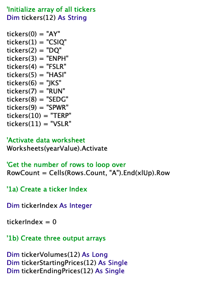
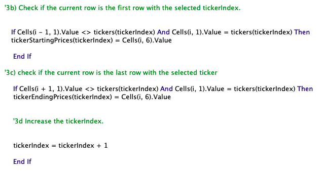

# Stock Analysis using Visual Basic Application (VBA)
Refactoring an existing VBA code to increase efficiency and quality of stock analysis. 

## Overview of Project 
### Background
Steve acquired the help of a data analyst to produce a code using VBA, that allows him to analyze stock datasets within seconds. With this code, Steve was able to retrieve the daily total volume and return of 12 different stocks in the years of 2017 and 2018. However, Steve is concerned that if he were to analyze thousands of stock datasets, the code would not work as well. 

### Purpose
In this project, the original VBA code was refactored to improve structure and efficiency, while maintaining functionality and outputting accurate stock analysis. The original code and new code will be compared to deduce whether refactoring did indeed improve the efficiency of the stock analysis.

## Results 
In the refactored code I created 3 additional arrays (as shown below): tickerVolumes, tickerStartingPrices and tickerEndingPrices. The tickers array from the original code was also used in the refactored code to call each stock. A tickerIndex variable was created to access the correct stock ticker index in each array. 

###### Refactored Code and Arrays

For loops were used to initialize the tickerVolumes array and loop over all rows (shown below). The tickerIndex variable was consistently used as the index. tickerVolumes was increased for each stock based on the current stock ticker. 
###### Refactored Code and For Loops

Conditional statements were used to gather starting price and ending price of each stock (shown below). Once again, the tickerIndex variable was used as the stock index. tickerIndex was increased respectively.
###### Refactored Code and Conditionals

## Summary 
Advantage of the arrays  - array 
