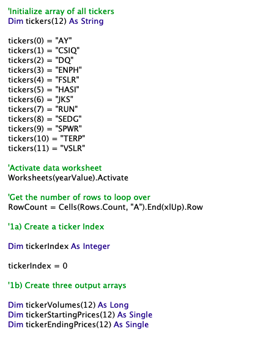
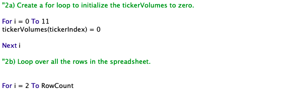
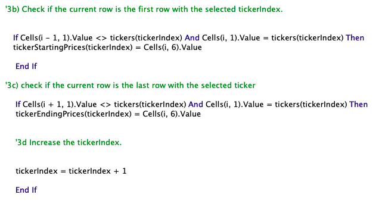
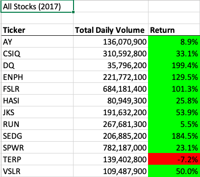
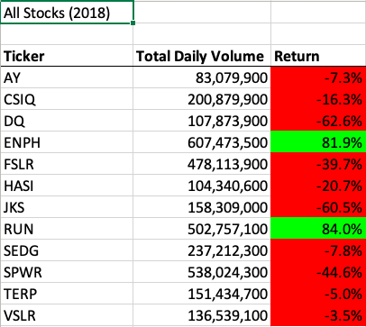
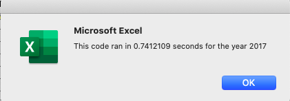
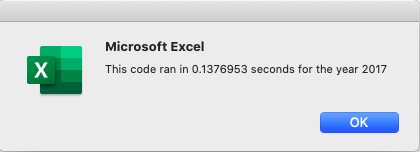
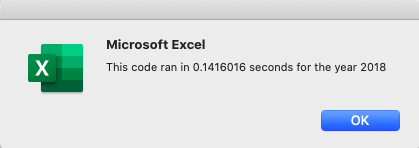

# Stock Analysis using Visual Basic Application (VBA)
Refactoring an existing VBA code to increase efficiency of stock analysis. 

## Overview of Project 
### Background
Steve acquired the help of a data analyst to produce a code using VBA, that allows him to analyze stock datasets within seconds. With this code, Steve was able to retrieve the daily total volume and return of 12 different stocks in the years of 2017 and 2018. However, Steve is concerned that if he were to analyze thousands of stock datasets, the code would not work as well. 

### Purpose
In this project, the original VBA code was refactored to improve structure and efficiency, while maintaining functionality and its external behaviour of stock analysis. The execution times of the original code and new code will be compared to deduce whether refactoring did indeed improve the efficiency of the analysis.

## Results 
1) In the refactored code I created 3 additional arrays (as shown below): tickerVolumes, tickerStartingPrices and tickerEndingPrices. The tickers array from the original code was also used in the refactored code. A tickerIndex variable was created to access the correct stock ticker index in each array. 

###### Refactored Code and Arrays

2) For loops were used to initialize the tickerVolumes array and loop over all rows (shown below). The tickerIndex variable was consistently used as the index. tickerVolumes was increased for each stock based on the current stock ticker. 
###### Refactored Code and For Loops

3) Conditional statements were used to gather starting price and ending price of each stock (shown below). Once again, the tickerIndex variable was used as the stock index. tickerIndex was increased respectively.
###### Refactored Code and Conditionals

4) Both the original code and the refactored code were able to produce accurate stock analysis, showing the total daily volume and return of each stock in 2017 and 2018. Below are the stock analysis from 2017 and 2018. Overall, the majority of stocks had a positive annual return in 2017 compared to 2018. 
###### 2017 and 2018 Stock Analysis

5)The main focus of this project is to compare the effiency of the original code and refactored code. Using the VBA timer function, I was able to record the execution time for each stock analysis. Below are the execution times for the 2017 and 2018 stock analyses with the original code and refactored code. It is apparent that the refactored code cut down execution times by approximately 0.6 seconds.
###### Execution Times with Original Code

###### Execution Times with Refactored Code

## Summary 
### Advantages and Disadvantages of Refactoring Code in General
Refactoring codes is very common practice with many advantages. Mainly, refactoring allows for the code to be structured in a cleaner and more maintable way. In the process, bugs will be fixed and repeition will be eliminated. Overall, refactoring will produce a faster, more efficient code. Although, refactoring maintains the same external behaviour of the original code, it is possible for a refactored code to unintentionally change the external behaviour. It is a somewhat risky process, especially if the code is extensive. Furthermore, refactoring can be timely and costly. 

### Advantages and Disadvantages of My Refactored Code
The refactored VBA script included for loops and 3 additional arrays. An array is a memory location that can hold an arbitrary number of variables of the same data type. We used arrays in the refactored code so that we don't have to give each variable its own name. Instead, we defined the array (i.e tickerVolumes) and accessed the variables using their index. By using for loops and arrays, the code is not repeating over and over again. The refactored code is more maintaible and easier to troubleshoot. Furthermore, the use of arrays makes it easier to sort and analyze data, leading to increased efficiency. The refactored code also included several comments that makes it easier to read and follow. This is good practice when you are handing your code off to others. Although the refactored code minimizes reptition, the code does appear more busy at first glance. To increase efficiency we included the index, tickerIndex, in several lines throughout the code. This adds a lot of characters to the code.
